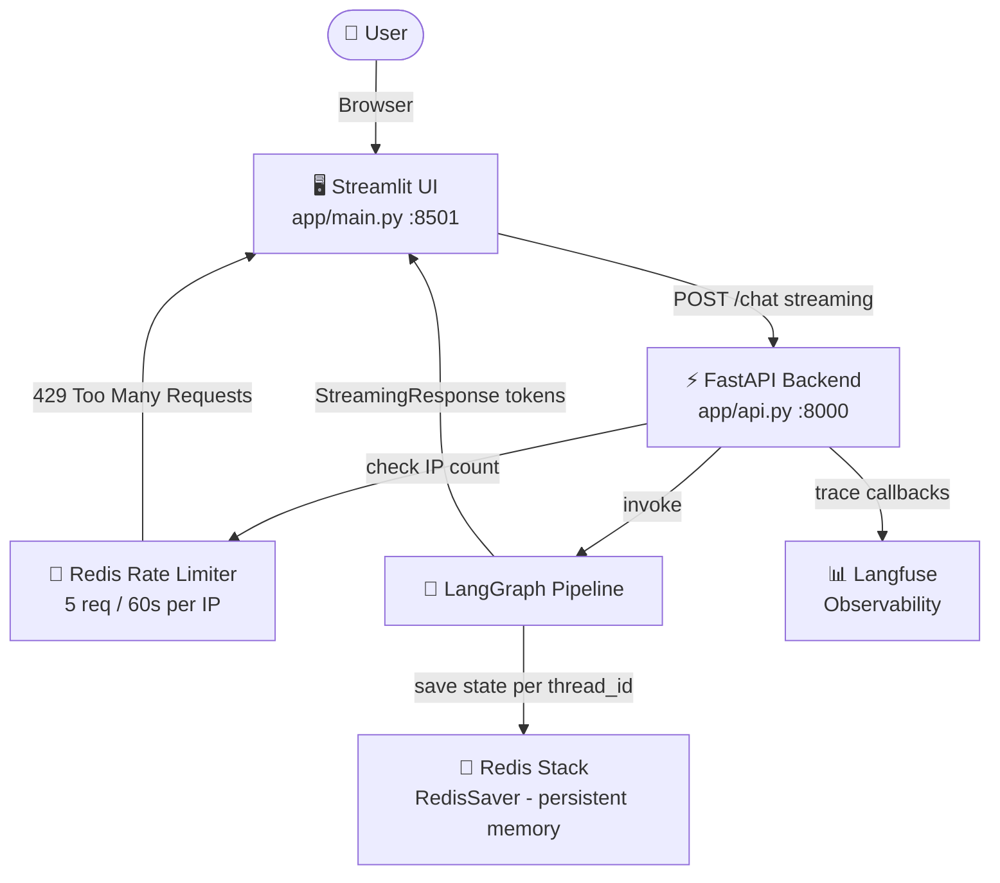
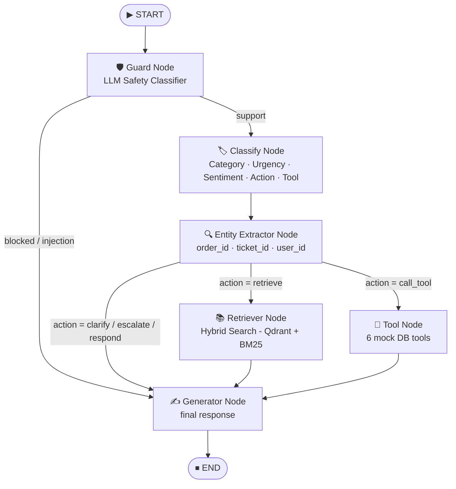
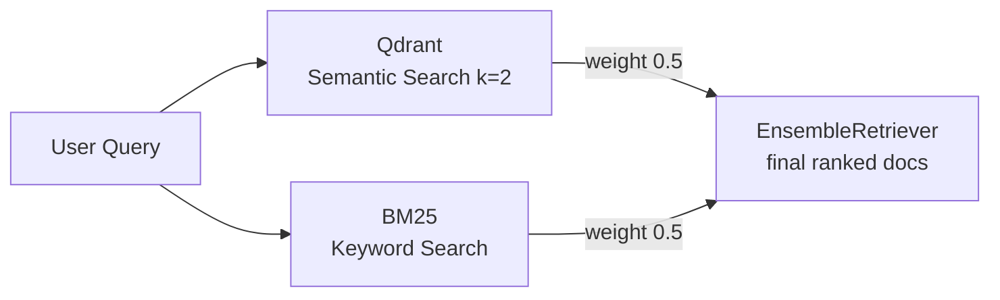
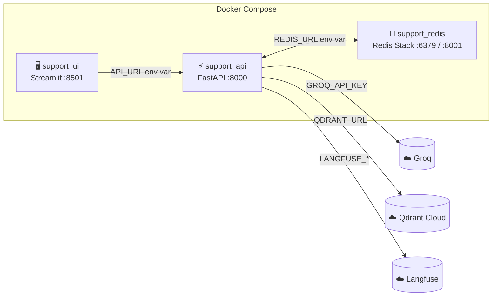
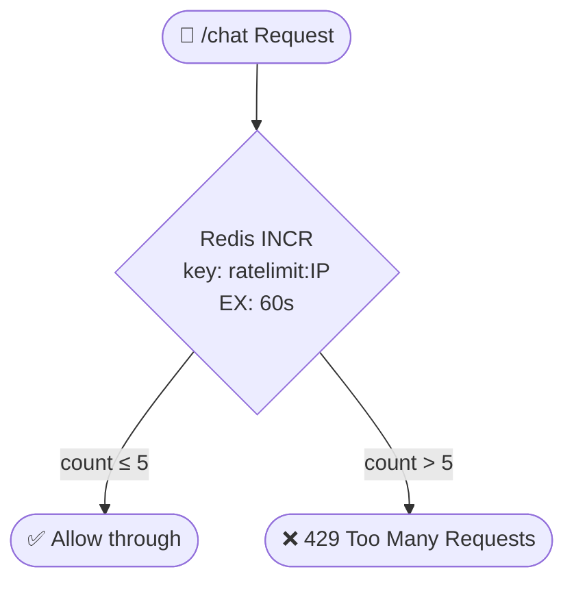
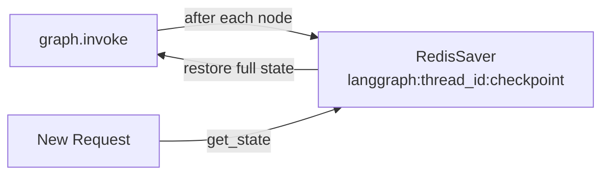

# 🏗️ System Architecture

> **Agentic Customer Support AI** — Detailed technical architecture covering the current live design and infrastructure.

---

## 📐 High-Level System Flow

---

## 🔄 LangGraph Agent Pipeline

---

## 🧩 Node Reference

### 🛡️ Guard Node
**File:** `app/agents/nodes/guard_node.py`

Uses a **dedicated LLM call** (ChatGroq, temperature=0) to classify every message before any other processing. Not keyword-based — handles nuanced phrasing.

| Classification | Meaning | Action |
|---|---|---|
| `support` | Order, shipment, return, billing, greeting, intro | Pass through to pipeline |
| `blocked` | Completely off-topic (recipes, math, politics) | Short-circuit to Generator with polite refusal |
| `injection` | Prompt injection / jailbreak attempt | Short-circuit to Generator with safety message |

---

### 🏷️ Classify Node
**File:** `app/agents/nodes/classify_node.py`

Uses **structured output** (`ClassificationSchema`) so the LLM returns a guaranteed-valid Pydantic object, not free-form text.

| Output Field | Example Values |
|---|---|
| `category` | `order`, `billing`, `account`, `shipping`, `return`, `general` |
| `urgency` | `low`, `medium`, `high` |
| `sentiment` | `positive`, `neutral`, `negative` |
| `action` | `retrieve`, `call_tool`, `clarify`, `escalate`, `respond` |
| `tool_name` | `track_order`, `cancel_order`, `check_return_eligibility`, `check_ticket_status`, `get_ticket`, `get_user` |

### 🔍 Entity Extractor Node
**File:** `app/agents/nodes/entity_node.py`

Uses **structured output** (`EntitySchema`) to parse IDs from the user message. Only updates state fields if a value is found — preserves IDs from previous turns.

| Extracted | Example | Persists across turns? |
|---|---|---|
| `order_id` | `ORD-1011` | ✅ Yes (only updated if found) |
| `ticket_id` | `TKT-202` | ✅ Yes |
| `user_id` | `USR-99` | ✅ Yes |

---

### 📚 Retriever Node
**File:** `app/agents/nodes/retriever_node.py`

Triggers a **hybrid search** combining:
- **Dense retrieval** — Qdrant Cloud cosine similarity using `BAAI/bge-base-en-v1.5` (768-dim vectors)
- **Sparse retrieval** — BM25 keyword matching via `langchain-classic` EnsembleRetriever

---

### 🔧 Tool Node
**File:** `app/agents/nodes/tool_node.py`

Dispatches to one of 6 tools based on `tool_name` set by the Classify node. All tools read from mock JSON files on disk.

| Tool | Invoked When | Source |
|---|---|---|
| `track_order` | User asks about order status / location | `OrderTool` (uses `orders.json` & `tracking.json`) |
| `cancel_order` | User wants to cancel an order | `OrderTool` |
| `check_return_eligibility` | User wants to return an item | `OrderTool` |
| `check_ticket_status` | User asks about a support ticket | `TicketTool` (returns enriched history from `tickets.json`) |
| `get_ticket` | User wants full ticket details | `TicketTool` |
| `get_user` | Agent needs to look up a user profile | `UserTool` |

---

### ✍️ Generator Node
**Files:** `app/agents/nodes/generater_node.py` · `app/rag/generate.py`

Two different methods are used depending on context:
- **`generate()`** — called inside the LangGraph pipeline (non-streaming, result stored in state)
- **`stream_generate()`** — called by the FastAPI endpoint to stream tokens directly to Streamlit

---

## 🗄️ Agent State Schema

**File:** `app/agents/state.py`

| Field | Type | Set By | Description |
|---|---|---|---|
| `messages` | `Annotated[list, add_messages]` | All nodes | Full conversation history — append-only reducer |
| `ticket` | `str` | `graph.run()` | Current user message |
| `category` | `str` | Classify Node | Support category |
| `urgency` | `str` | Classify Node | Urgency level |
| `sentiment` | `str` | Classify Node | User sentiment |
| `action` | `str` | Classify Node / Guard Node | Routing decision |
| `tool_name` | `str` | Classify Node | Which tool to call |
| `documents` | `list[Document]` | Retriever Node | RAG results |
| `tool_result` | `dict` | Tool Node | DB lookup result |
| `response` | `str` | Generator Node | Final text response |
| `order_id` | `str \| None` | Entity Node | Extracted order ID |
| `ticket_id` | `str \| None` | Entity Node | Extracted ticket ID |
| `user_id` | `str \| None` | Entity Node | Extracted user ID |

---

## 🐳 Docker Infrastructure

| Container | Image | Ports |
|---|---|---|
| `support_redis` | `redis/redis-stack:latest` | `6379` (DB) · `8001` (RedisInsight UI) |
| `support_api` | Built from `Dockerfile` | `8000` |
| `support_ui` | Built from `Dockerfile` | `8501` |

---

## 🔴 Redis — Three Active Use Cases

### 1️⃣ Rate Limiting ✅ Active

**File:** `app/middleware/rate_limiter.py`
Limit: **5 requests / 60 seconds per IP** — applied only to `/chat`.

---

### 2️⃣ Persistent Memory ✅ Active

**File:** `app/agents/graph.py`
Uses `RedisSaver(REDIS_URL)` with `memory.setup()` called on boot to ensure all required RediSearch indexes exist.

---

## 🔐 Security Layers

| Layer | Mechanism | Status |
|---|---|---|
| **Input Safety** | Guard Node — LLM detects injection & off-topic before pipeline | ✅ Active |
| **Rate Limiting** | Redis per-IP counter (5 req/60s) | ✅ Active |
| **Secret Management** | All keys via `.env` — never hardcoded | ✅ Active |
| **Auth / Login** | None — open to any user | ❌ Not implemented |

---

---

## 📁 Key File Reference

| File | Role |
|---|---|
| `app/api.py` | FastAPI entry point — `/chat` streaming endpoint + middleware registration |
| `app/main.py` | Streamlit chat UI with multi-session sidebar |
| `app/agents/graph.py` | LangGraph graph compiler, `run()` method, RedisSaver setup |
| `app/agents/state.py` | Shared `AgentState` TypedDict |
| `app/agents/router.py` | Conditional routing function (returns `action` string) |
| `app/agents/nodes/guard_node.py` | LLM safety classifier |
| `app/agents/nodes/classify_node.py` | Category / urgency / sentiment / action |
| `app/agents/nodes/entity_node.py` | Entity extraction |
| `app/agents/nodes/retriever_node.py` | Hybrid Qdrant + BM25 search |
| `app/agents/nodes/tool_node.py` | Mock DB tool dispatcher |
| `app/agents/nodes/generater_node.py` | Non-streaming generator (used inside graph) |
| `app/rag/generate.py` | `Generator` — `generate()` + `stream_generate()` |
| `app/rag/retriever.py` | `EnsembleRetriever` initialization |
| `app/rag/qdrant.py` | Qdrant Cloud client |
| `app/middleware/rate_limiter.py` | Redis rate limit middleware |
| `app/config/config.py` | Centralized env config |
